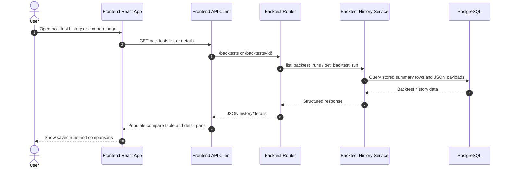

# Backtest History and Compare

```mermaid
sequenceDiagram
    autonumber
    actor U as User
    participant FE as Frontend React App
    participant API as Frontend API Client
    participant BR as Backtest Router
    participant BHS as Backtest History Service
    participant PG as PostgreSQL

    U->>FE: Open backtest history or compare page
    FE->>API: GET backtests list or details
    API->>BR: /backtests or /backtests/{id}
    BR->>BHS: list_backtest_runs / get_backtest_run
    BHS->>PG: Query stored summary rows and JSON payloads
    PG-->>BHS: Backtest history data
    BHS-->>BR: Structured response
    BR-->>API: JSON history/details
    API-->>FE: Populate compare table and detail panel
    FE-->>U: Show saved runs and comparisons
```
