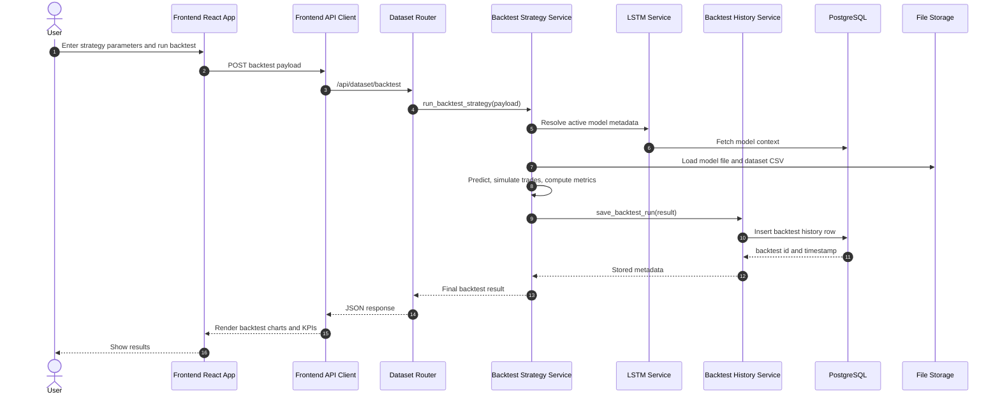

# Backtesting

```mermaid
sequenceDiagram
    autonumber
    actor U as User
    participant FE as Frontend React App
    participant API as Frontend API Client
    participant DR as Dataset Router
    participant BS as Backtest Strategy Service
    participant LS as LSTM Service
    participant BHS as Backtest History Service
    participant PG as PostgreSQL
    participant FS as File Storage

    U->>FE: Enter strategy parameters and run backtest
    FE->>API: POST backtest payload
    API->>DR: /api/dataset/backtest
    DR->>BS: run_backtest_strategy(payload)
    BS->>LS: Resolve active model metadata
    LS->>PG: Fetch model context
    BS->>FS: Load model file and dataset CSV
    BS->>BS: Predict, simulate trades, compute metrics
    BS->>BHS: save_backtest_run(result)
    BHS->>PG: Insert backtest history row
    PG-->>BHS: backtest id and timestamp
    BHS-->>BS: Stored metadata
    BS-->>DR: Final backtest result
    DR-->>API: JSON response
    API-->>FE: Render backtest charts and KPIs
    FE-->>U: Show results
```
