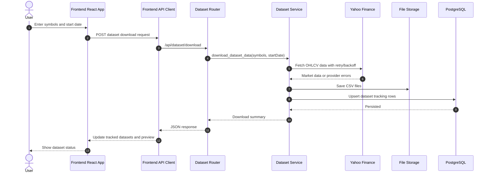

# Dataset Preparation

```mermaid
sequenceDiagram
    autonumber
    actor U as User
    participant FE as Frontend React App
    participant API as Frontend API Client
    participant DR as Dataset Router
    participant DS as Dataset Service
    participant YF as Yahoo Finance
    participant FS as File Storage
    participant PG as PostgreSQL

    U->>FE: Enter symbols and start date
    FE->>API: POST dataset download request
    API->>DR: /api/dataset/download
    DR->>DS: download_dataset_data(symbols, startDate)
    DS->>YF: Fetch OHLCV data with retry/backoff
    YF-->>DS: Market data or provider errors
    DS->>FS: Save CSV files
    DS->>PG: Upsert dataset tracking rows
    PG-->>DS: Persisted
    DS-->>DR: Download summary
    DR-->>API: JSON response
    API-->>FE: Update tracked datasets and preview
    FE-->>U: Show dataset status
```
