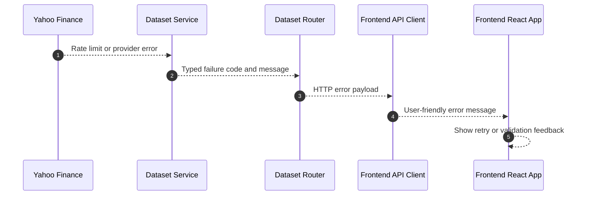

# Error Handling

```mermaid
sequenceDiagram
    autonumber
    participant YF as Yahoo Finance
    participant DS as Dataset Service
    participant DR as Dataset Router
    participant API as Frontend API Client
    participant FE as Frontend React App

    YF-->>DS: Rate limit or provider error
    DS-->>DR: Typed failure code and message
    DR-->>API: HTTP error payload
    API-->>FE: User-friendly error message
    FE-->>FE: Show retry or validation feedback
```
