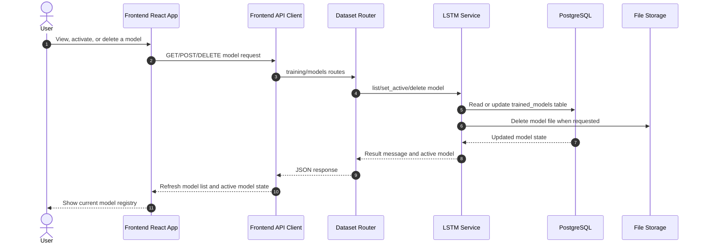

# Model Management

```mermaid
sequenceDiagram
    autonumber
    actor U as User
    participant FE as Frontend React App
    participant API as Frontend API Client
    participant DR as Dataset Router
    participant LS as LSTM Service
    participant PG as PostgreSQL
    participant FS as File Storage

    U->>FE: View, activate, or delete a model
    FE->>API: GET/POST/DELETE model request
    API->>DR: training/models routes
    DR->>LS: list/set_active/delete model
    LS->>PG: Read or update trained_models table
    LS->>FS: Delete model file when requested
    PG-->>LS: Updated model state
    LS-->>DR: Result message and active model
    DR-->>API: JSON response
    API-->>FE: Refresh model list and active model state
    FE-->>U: Show current model registry
```
