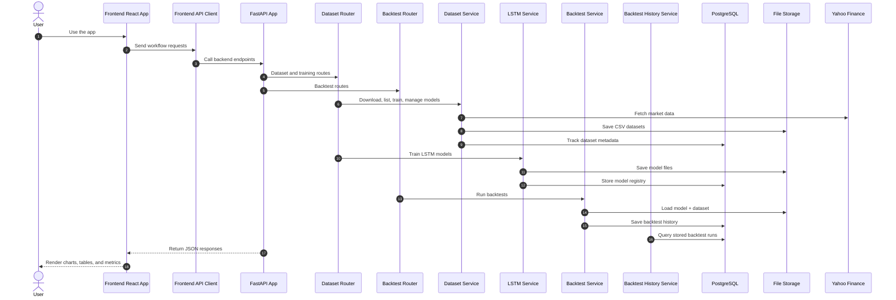

# Overview

```mermaid
sequenceDiagram
    autonumber
    actor U as User
    participant FE as Frontend React App
    participant API as Frontend API Client
    participant FAST as FastAPI App
    participant DR as Dataset Router
    participant BR as Backtest Router
    participant DS as Dataset Service
    participant LS as LSTM Service
    participant BS as Backtest Service
    participant BHS as Backtest History Service
    participant PG as PostgreSQL
    participant FS as File Storage
    participant YF as Yahoo Finance

    U->>FE: Use the app
    FE->>API: Send workflow requests
    API->>FAST: Call backend endpoints
    FAST->>DR: Dataset and training routes
    FAST->>BR: Backtest routes
    DR->>DS: Download, list, train, manage models
    DS->>YF: Fetch market data
    DS->>FS: Save CSV datasets
    DS->>PG: Track dataset metadata
    DR->>LS: Train LSTM models
    LS->>FS: Save model files
    LS->>PG: Store model registry
    BR->>BS: Run backtests
    BS->>FS: Load model + dataset
    BS->>PG: Save backtest history
    BHS->>PG: Query stored backtest runs
    FAST-->>FE: Return JSON responses
    FE-->>U: Render charts, tables, and metrics
```
