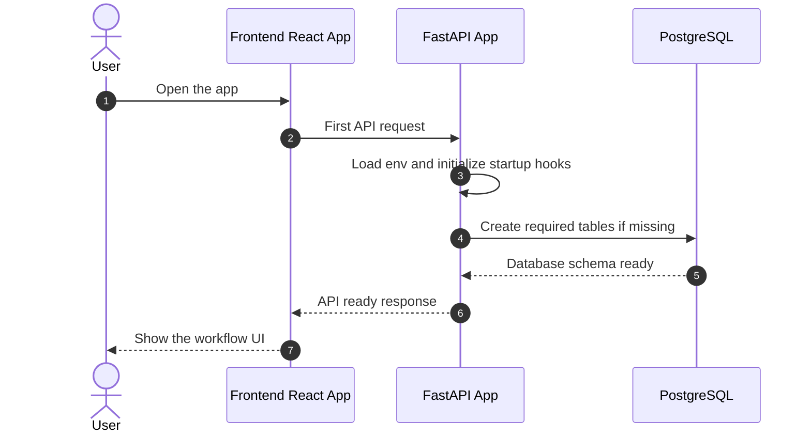

# Startup

```mermaid
sequenceDiagram
    autonumber
    actor U as User
    participant FE as Frontend React App
    participant FAST as FastAPI App
    participant PG as PostgreSQL

    U->>FE: Open the app
    FE->>FAST: First API request
    FAST->>FAST: Load env and initialize startup hooks
    FAST->>PG: Create required tables if missing
    PG-->>FAST: Database schema ready
    FAST-->>FE: API ready response
    FE-->>U: Show the workflow UI
```
