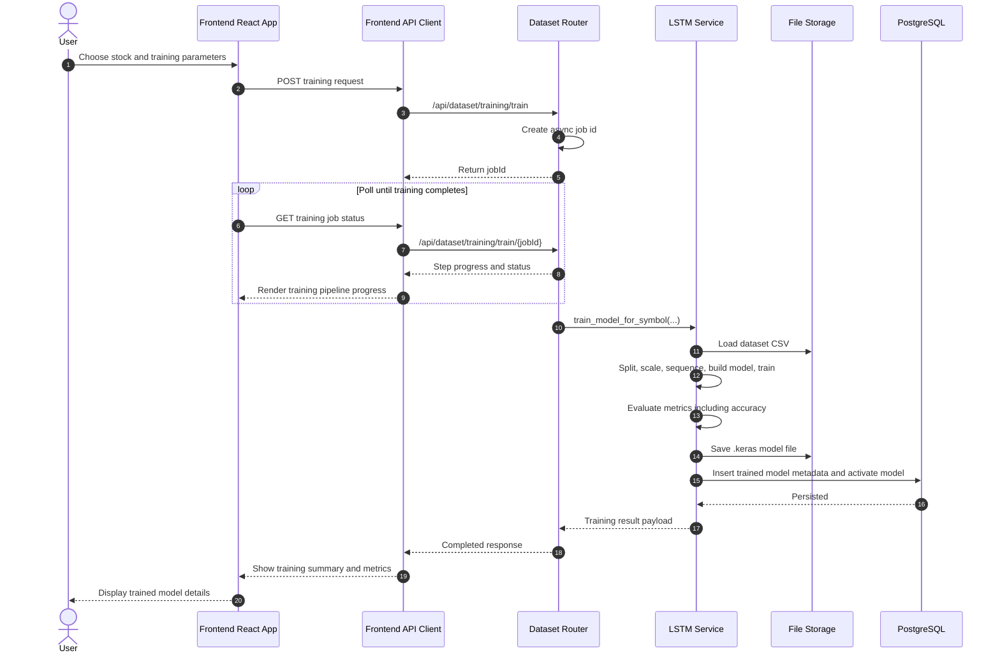

# Training

```mermaid
sequenceDiagram
    autonumber
    actor U as User
    participant FE as Frontend React App
    participant API as Frontend API Client
    participant DR as Dataset Router
    participant LS as LSTM Service
    participant FS as File Storage
    participant PG as PostgreSQL

    U->>FE: Choose stock and training parameters
    FE->>API: POST training request
    API->>DR: /api/dataset/training/train
    DR->>DR: Create async job id
    DR-->>API: Return jobId
    loop Poll until training completes
        FE->>API: GET training job status
        API->>DR: /api/dataset/training/train/{jobId}
        DR-->>API: Step progress and status
        API-->>FE: Render training pipeline progress
    end
    DR->>LS: train_model_for_symbol(...)
    LS->>FS: Load dataset CSV
    LS->>LS: Split, scale, sequence, build model, train
    LS->>LS: Evaluate metrics including accuracy
    LS->>FS: Save .keras model file
    LS->>PG: Insert trained model metadata and activate model
    PG-->>LS: Persisted
    LS-->>DR: Training result payload
    DR-->>API: Completed response
    API-->>FE: Show training summary and metrics
    FE-->>U: Display trained model details
```
